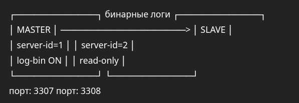
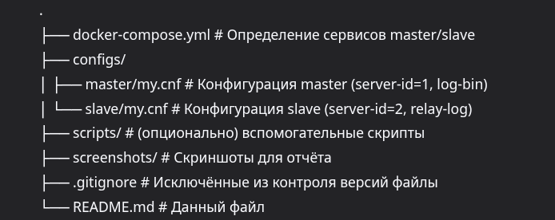
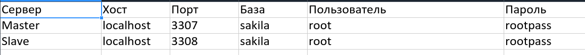
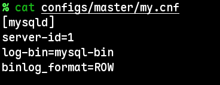
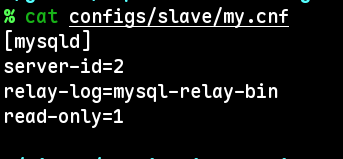
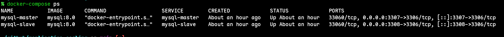
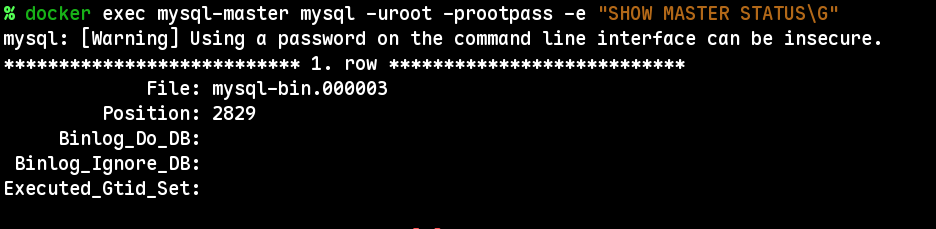
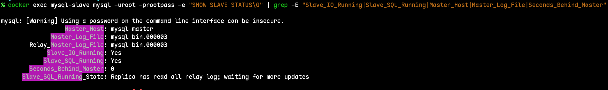
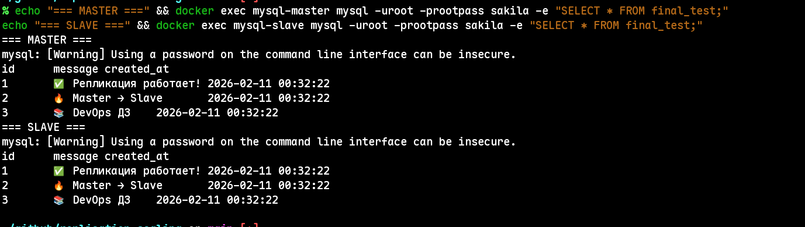

# Домашнее задание: Репликация и масштабирование" - Шаров Олег

## Задание 1: Настройка Master-Slave репликации MySQL

### Описание
Настроена асинхронная репликация типа **Master → Slave** для СУБД MySQL 8.0 с использованием Docker.

### Схема работы




### Структура проекта




### Запуск окружения
```bash
# Запуск контейнеров
docker-compose up -d

# Остановка
docker-compose down
```

## Проверка репликации

```bash
# Статус репликации на slave
docker exec mysql-slave mysql -uroot -prootpass -e "SHOW SLAVE STATUS\G" | grep Running

# Тестовая запись на master
docker exec mysql-master mysql -uroot -prootpass sakila -e \
  "CREATE TABLE test_replication (id INT AUTO_INCREMENT PRIMARY KEY, msg VARCHAR(50)); \
   INSERT INTO test_replication (msg) VALUES ('Репликация работает!');"

# Проверка на slave (через 2 сек)
sleep 2
docker exec mysql-slave mysql -uroot -prootpass sakila -e "SELECT * FROM test_replication;"
```

## Параметры подключения



## Особенности реализации
- Использован плагин аутентификации `mysql_native_password` для пользователя `repl` (совместимость с репликацией в MySQL 8.0)
- Slave настроен в режиме `read-only` для предотвращения случайной записи
- Данные хранятся в директориях `master-data/` и `slave-data/` на хосте

## Скриншоты
См. каталог screenshots/

Скриншот 1: Конфигурация master



Скриншот 2: Конфигурация slave



Скриншот 3: Статус контейнеров



Скриншот 4: Статус master



Скриншот 5: Статус репликации



Скриншот 6: Тест репликации




##  Домашнее задание 2: План шардинга базы данных

### 1. Принципы построения системы
** Вертикальный шардинг (разделение по столбцам)**
- Что делит: Столбцы (атрибуты) одной таблицы
- Когда применяется:
  - Таблица содержит «тяжёлые» поля (BLOB, TEXT), которые редко используются
  - Часть полей имеет разные требования к безопасности (например, пароли vs профильные данные)

- **Пример для таблицы пользователи:**
   - Шард 1: id, email, пароль_hash — критичные для авторизации данные
   - Шард 2: имя, фото_blob, адрес, телефон — профильные данные
**Горизонтальный шардинг (разделение по строкам)**

- Что делит: Строки (записи) таблицы по логическому критерию
- Когда применяется:
  - Таблица содержит миллионы записей
  - Нагрузка распределяется по географии, диапазону ID или бизнес-сущностям
- **Пример для таблицы магазины:**
  - Шард 1: магазины Москвы (город = 'Москва')
  - Шард 2: магазины СПб (город = 'Санкт-Петербург')
  - Шард 3: остальные регионы


